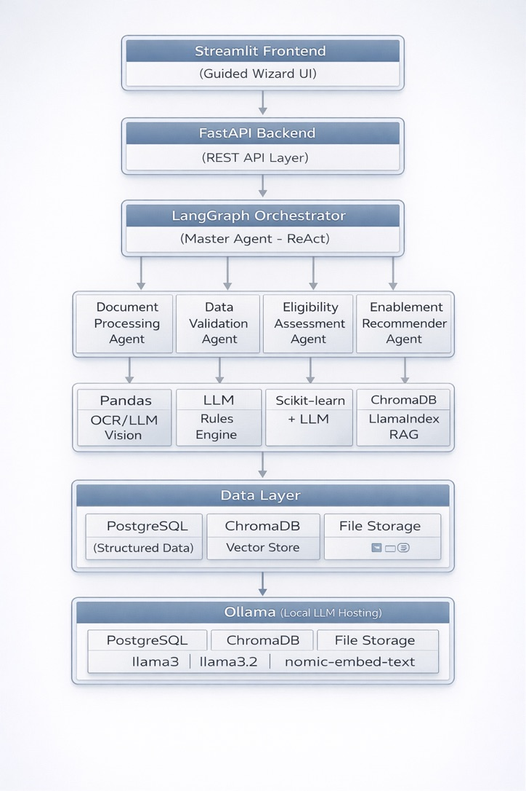

# Social Support Application Workflow Automation

An AI-powered system that automates the assessment of social support applications for a government social security department. The system uses a multi-agent architecture with locally hosted LLMs to process documents, validate data, assess eligibility, and recommend enablement programs — reducing the process from 5–20 working days to minutes.

---

## Table of Contents

1. [Prerequisites](#prerequisites)
2. [Installation](#installation)
3. [Configuration](#configuration)
4. [Running the Application](#running-the-application)
5. [Testing the Application](#testing-the-application)
6. [Project Structure](#project-structure)
7. [Architecture Overview](#architecture-overview)
8. [Technology Stack](#technology-stack)
9. [API Endpoints](#api-endpoints)
10. [Troubleshooting](#troubleshooting)

---

## Prerequisites

Ensure the following are installed on your machine before starting:

| Tool                 | Minimum Version | Installation                                            |
| -------------------- | --------------- | ------------------------------------------------------- |
| **Python**           | 3.11+           | `brew install python@3.12`                              |
| **PostgreSQL**       | 14+             | `brew install postgresql@14`                            |
| **Ollama**           | 0.1.0+          | [Download from ollama.com](https://ollama.com/download) |
| **Homebrew** (macOS) | —               | [brew.sh](https://brew.sh)                              |
| **Git**              | —               | `brew install git`                                      |

### Verify installations

```bash
python3 --version        # Python 3.11+
psql --version           # PostgreSQL 14+
ollama --version         # Ollama installed
git --version            # Git installed
```

---

## Installation

### Step 1: Clone the repository

```bash
git clone <repository-url>
cd social-support-app
```

### Step 2: Pull required Ollama models

The application uses three locally hosted models. Pull them before starting:

```bash
# Main reasoning model (8B parameters)
ollama pull llama3

# Light model for faster tasks (3B parameters)
ollama pull llama3.2

# Embedding model for RAG vector store
ollama pull nomic-embed-text
```

Verify models are available:

```bash
ollama list
```

You should see `llama3`, `llama3.2`, and `nomic-embed-text` in the list.

### Step 3: Create Python virtual environment

```bash
python3 -m venv venv
source venv/bin/activate
```

### Step 4: Install Python dependencies

```bash
pip install -r requirements.txt
```

This installs all required packages including FastAPI, LangGraph, LangChain, Scikit-learn, ChromaDB, LlamaIndex, Streamlit, and more. Installation may take 2–3 minutes.

### Step 5: Start PostgreSQL and create database

Start the PostgreSQL service:

```bash
# macOS with Homebrew
brew services start postgresql@14
```

Create the application database:

```bash
createdb social_support_db
```

Verify it was created:

```bash
psql -d social_support_db -c "SELECT 1"
```

### Step 6: Generate synthetic data and train ML model

```bash
# Generate 500 training records + 5 sample applicants with documents
python -m app.utils.synthetic_data
```

This creates:

- `data/synthetic/training_data.json` — 500 synthetic applicant records
- `data/synthetic/sample_applicants.json` — 5 applicants with full document sets
- Sample bank statements (CSV), resumes (TXT), assets (XLSX), credit reports (TXT), Emirates IDs (TXT)

### Step 7: Initialize database tables

```bash
python -c "from app.database import init_db; init_db(); print('Tables created')"
```

Verify:

```bash
psql -d social_support_db -c "\dt"
```

You should see three tables: `applicants`, `documents`, `decisions`.

---

## Configuration

The application uses environment variables defined in the `.env` file at the project root.

### Default `.env` file

```env
DATABASE_URL=postgresql://<your-username>@localhost:5432/social_support_db
OLLAMA_BASE_URL=http://localhost:11434
LLM_MODEL=llama3
LIGHT_LLM_MODEL=llama3.2
EMBEDDING_MODEL=nomic-embed-text
CHROMA_PERSIST_DIR=./data/chroma_db
LANGFUSE_PUBLIC_KEY=
LANGFUSE_SECRET_KEY=
LANGFUSE_HOST=http://localhost:3000
UPLOAD_DIR=./data/uploads
POLICY_DIR=./data/policies
```

**Important:** Replace `<your-username>` in `DATABASE_URL` with your macOS username. Find it by running `whoami`.

### Langfuse (Optional)

Agent observability via Langfuse is optional. To enable it:

1. Run Langfuse locally (see [Langfuse self-hosting docs](https://langfuse.com/docs/deployment/self-host))
2. Set `LANGFUSE_PUBLIC_KEY` and `LANGFUSE_SECRET_KEY` in `.env`

The application works fully without Langfuse — agent traces are captured in the database and visible in the UI.

---

## Running the Application

You need **two terminal windows** — one for the backend API and one for the frontend UI.

### Terminal 1: Start Ollama (if not already running)

```bash
ollama serve
```

### Terminal 2: Start the FastAPI backend

```bash
cd social-support-app
source venv/bin/activate
uvicorn app.main:app --host 0.0.0.0 --port 8000
```

On first startup, the backend will:

1. Create database tables (if not already done)
2. Train the ML eligibility classifier on 500 synthetic records
3. Ingest policy documents into the ChromaDB vector store

Wait until you see:

```
INFO:     Uvicorn running on http://0.0.0.0:8000
```

Verify the backend is running:

```bash
curl http://localhost:8000/api/health
# Expected: {"status":"healthy","service":"Social Support Application System"}
```

### Terminal 3: Start the Streamlit frontend

```bash
cd social-support-app
source venv/bin/activate
streamlit run frontend/streamlit_app.py --server.port 8501
```

The UI opens automatically at **http://localhost:8501**.

---

## Testing the Application

The application has a **guided 5-step wizard**. Follow the steps below to test the full workflow.

### Step 1: Submit a New Application

1. Open **http://localhost:8501** in your browser
2. You will see **Step 1: Submit New Application**
3. Fill in the form with test data:

   | Field                | Sample Value         |
   | -------------------- | -------------------- |
   | Full Name            | `Fatima Hassan`      |
   | Emirates ID          | `784-1995-7654321-2` |
   | Age                  | `28`                 |
   | Gender               | Female               |
   | Nationality          | UAE                  |
   | Marital Status       | Divorced             |
   | Family Size          | `4`                  |
   | Dependents           | `3`                  |
   | Education Level      | High School          |
   | Employment Status    | Unemployed           |
   | Monthly Income (AED) | `800`                |

4. Click **"Submit Application & Go to Step 2"**
5. Note the **Applicant ID** shown in the success message

### Step 2: Upload Supporting Documents

1. The wizard advances to **Step 2: Upload Documents**
2. Upload sample documents from the `data/synthetic/` folder:

   | Document Type        | Sample File                           |
   | -------------------- | ------------------------------------- |
   | Bank Statement       | `data/synthetic/bank_statement_*.csv` |
   | Emirates ID          | `data/synthetic/eid_*.txt`            |
   | Resume / CV          | `data/synthetic/resume_*.txt`         |
   | Assets & Liabilities | `data/synthetic/assets_*.xlsx`        |
   | Credit Report        | `data/synthetic/credit_*.txt`         |

3. For each file: select the file, then click the **Upload** button
4. Click **"Proceed to Step 3"**

> **Note:** You can skip uploading some documents — the AI will work with whatever is available.

### Step 3: Run AI Assessment

1. The wizard advances to **Step 3: AI Assessment**
2. Click **"Run AI Assessment"**
3. Watch the progress bar as 4 agents execute in sequence:
   - **Document Processing Agent** — extracts data from uploaded files
   - **Data Validation Agent** — cross-checks information for inconsistencies
   - **Eligibility Assessment Agent** — scores the applicant using ML + LLM
   - **Enablement Recommender Agent** — suggests programs via RAG
4. The assessment typically takes **30–90 seconds** depending on your hardware
5. You will see the result: **APPROVED**, **SOFT DECLINE**, or **MANUAL REVIEW**
6. Expand **"Agent Execution Trace"** to see what each agent did
7. Click **"View Full Decision Dashboard"**

### Step 4: View Decision Dashboard

1. The dashboard shows:
   - **Recommendation** banner (Approved / Soft Decline / Manual Review)
   - **Score breakdown** — 5 metrics: Income, Employment, Family, Wealth, Demographic
   - **Bar chart** visualization of scores
   - **AI Reasoning** — LLM-generated explanation of the decision
   - **Recommended Enablement Programs** — with priority and reasoning
   - **Agent Execution Trace** — full observability of agent actions
2. Click **"Proceed to Step 5"**

### Step 5: Chat with AI Assistant

1. The chat interface allows natural language interaction
2. Try these questions:
   - `"Why was my application approved?"`
   - `"What training programs are available?"`
   - `"How can I improve my financial situation?"`
   - `"Tell me about job matching services"`
3. The AI responds with context from the applicant's profile and decision

### Testing Different Scenarios

To test different outcomes, submit new applications with varying profiles:

**High-need applicant (likely APPROVE — Tier 1):**

- Unemployed, income AED 500, family size 6, high school education

**Medium-need applicant (likely APPROVE — Tier 2):**

- Part-time, income AED 4,000, family size 3, diploma education

**Low-need applicant (likely SOFT DECLINE):**

- Employed, income AED 20,000, family size 2, master's degree

Click **"Start New Application"** in the sidebar to reset the wizard for a new applicant.

### Testing via API (Optional)

You can also test the backend directly using curl:

```bash
# Submit application
curl -X POST http://localhost:8000/api/submit-application \
  -H "Content-Type: application/json" \
  -d '{
    "full_name": "Test User",
    "emirates_id": "784-1990-1111111-1",
    "age": 40,
    "gender": "Male",
    "nationality": "UAE",
    "marital_status": "Married",
    "family_size": 5,
    "dependents": 3,
    "education_level": "High School",
    "employment_status": "Unemployed",
    "monthly_income": 1000
  }'

# Run assessment (replace 1 with actual applicant ID)
curl -X POST http://localhost:8000/api/assess/1

# Get decision
curl http://localhost:8000/api/decision/1

# List all applicants
curl http://localhost:8000/api/applicants

# Chat
curl -X POST http://localhost:8000/api/chat \
  -H "Content-Type: application/json" \
  -d '{"applicant_id": 1, "message": "What programs am I eligible for?"}'
```

### API Documentation

FastAPI auto-generates interactive API docs. Visit:

- **Swagger UI:** http://localhost:8000/docs
- **ReDoc:** http://localhost:8000/redoc

---

## Project Structure

```
social-support-app/
├── app/
│   ├── __init__.py
│   ├── config.py                  # Environment configuration (Pydantic Settings)
│   ├── database.py                # PostgreSQL connection and session management
│   ├── models.py                  # SQLAlchemy ORM models (Applicant, Document, Decision)
│   ├── schemas.py                 # Pydantic request/response schemas
│   ├── main.py                    # FastAPI application with all API endpoints
│   ├── agents/
│   │   ├── __init__.py
│   │   ├── orchestrator.py        # LangGraph master orchestrator (ReAct workflow)
│   │   ├── document_agent.py      # Document Processing Agent
│   │   ├── validation_agent.py    # Data Validation Agent
│   │   ├── eligibility_agent.py   # Eligibility Assessment Agent (ML + LLM)
│   │   └── enablement_agent.py    # Enablement Recommender Agent (RAG)
│   ├── services/
│   │   ├── __init__.py
│   │   ├── llm_service.py         # Ollama LLM integration (langchain-ollama)
│   │   ├── document_processor.py  # Document extraction (bank, ID, resume, assets, credit)
│   │   ├── ml_classifier.py       # Scikit-learn Gradient Boosting classifier
│   │   └── vector_store.py        # ChromaDB + LlamaIndex vector store for RAG
│   └── utils/
│       ├── __init__.py
│       └── synthetic_data.py      # Synthetic data generator for training and testing
├── data/
│   ├── policies/                  # Policy documents ingested into vector store
│   │   ├── eligibility_policy.txt
│   │   └── enablement_programs.txt
│   ├── synthetic/                 # Generated synthetic data and sample documents
│   ├── uploads/                   # Uploaded applicant documents (runtime)
│   └── chroma_db/                 # ChromaDB persistent storage (runtime)
├── frontend/
│   └── streamlit_app.py           # Streamlit guided wizard UI
├── .env                           # Environment variables
├── requirements.txt               # Python dependencies
└── README.md
```

---

## Architecture Overview



### Agent Pipeline

| Order | Agent                        | Responsibility                                                                                          | Tools Used                            |
| ----- | ---------------------------- | ------------------------------------------------------------------------------------------------------- | ------------------------------------- |
| 1     | Document Processing Agent    | Extracts structured data from bank statements, Emirates ID, resumes, assets/liabilities, credit reports | Pandas, LLM, Vision                   |
| 2     | Data Validation Agent        | Cross-checks extracted data for inconsistencies, flags discrepancies                                    | LLM + Rule engine                     |
| 3     | Eligibility Assessment Agent | Scores applicant on 5 criteria, produces approve/decline recommendation                                 | Scikit-learn (GradientBoosting) + LLM |
| 4     | Enablement Recommender Agent | Suggests upskilling, training, job matching, career counseling programs                                 | ChromaDB + LlamaIndex RAG + LLM       |

---

## Technology Stack

| Layer                | Technology                      | Purpose                           |
| -------------------- | ------------------------------- | --------------------------------- |
| Programming Language | Python 3.12                     | Core language                     |
| API Framework        | FastAPI                         | REST API with async support       |
| Frontend             | Streamlit                       | Interactive wizard UI             |
| LLM Hosting          | Ollama                          | Local LLM model serving           |
| LLM Models           | Llama 3 (8B), Llama 3.2 (3B)    | Reasoning and text generation     |
| Embedding Model      | nomic-embed-text                | Vector embeddings for RAG         |
| Agent Orchestration  | LangGraph                       | Stateful multi-agent workflow     |
| Agent Framework      | LangChain                       | LLM integration and tooling       |
| Reasoning Framework  | ReAct                           | Agent reasoning pattern           |
| ML Classification    | Scikit-learn (GradientBoosting) | Eligibility scoring               |
| Vector Store         | ChromaDB                        | Persistent vector storage for RAG |
| RAG Framework        | LlamaIndex                      | Document ingestion and retrieval  |
| Database             | PostgreSQL 14                   | Structured applicant data storage |
| Data Processing      | Pandas, openpyxl                | Tabular data extraction           |
| Observability        | Langfuse (optional)             | Agent tracing and monitoring      |

---

## API Endpoints

| Method   | Endpoint                    | Description                              |
| -------- | --------------------------- | ---------------------------------------- |
| `GET`    | `/api/health`               | Health check                             |
| `POST`   | `/api/submit-application`   | Submit new applicant data                |
| `POST`   | `/api/upload-document/{id}` | Upload a document for an applicant       |
| `POST`   | `/api/assess/{id}`          | Run the full 4-agent AI assessment       |
| `GET`    | `/api/decision/{id}`        | Get assessment decision for an applicant |
| `POST`   | `/api/chat`                 | Interactive chat about an application    |
| `GET`    | `/api/applicants`           | List all applicants                      |
| `DELETE` | `/api/applicant/{id}`       | Delete an applicant and all related data |

---

## Troubleshooting

### Ollama not running

```
Error: Cannot connect to Ollama
```

**Fix:** Start Ollama in a separate terminal:

```bash
ollama serve
```

### PostgreSQL not running

```
Error: connection refused on port 5432
```

**Fix:** Start PostgreSQL:

```bash
brew services start postgresql@14
```

### Database does not exist

```
Error: database "social_support_db" does not exist
```

**Fix:** Create it:

```bash
createdb social_support_db
```

### Port 8000 already in use

```
Error: Address already in use
```

**Fix:** Kill the existing process:

```bash
lsof -i :8000
kill -9 <PID>
```

### LLM responses are slow

Local LLM inference depends on your hardware. On machines with limited RAM:

- Use `llama3.2` (3B) as the main model by changing `LLM_MODEL=llama3.2` in `.env`
- Ensure no other memory-heavy applications are running during assessment

### Assessment returns "Application already assessed"

Each applicant can only be assessed once. To re-assess:

```bash
# Delete the applicant and re-submit, or use the API:
curl -X DELETE http://localhost:8000/api/applicant/<id>
```
